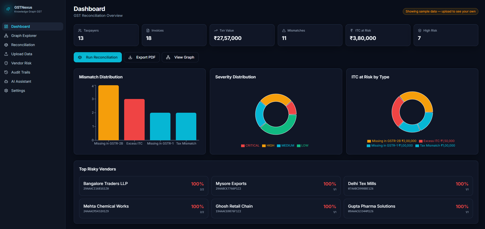
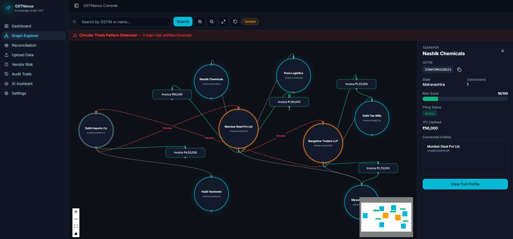
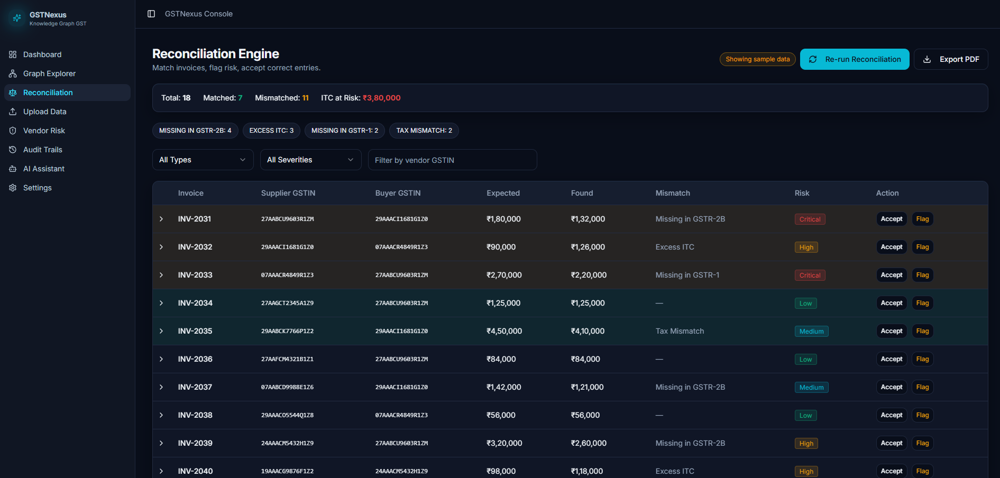
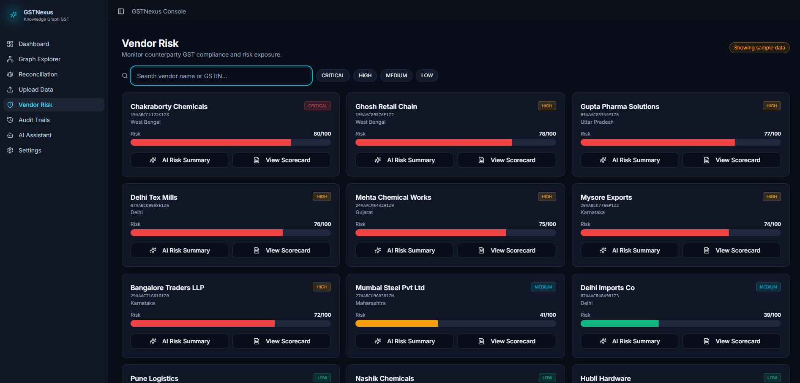

# 🧠 GSTNexus — Intelligent GST Reconciliation Platform

<div align="center">


[](https://react.dev)
[](https://tanstack.com/start)
[](https://workers.cloudflare.com)
[](https://supabase.com)
[](LICENSE)

**Detect circular trades. Validate ITC. Reconcile GST returns using Knowledge Graphs.**

[Live Demo](#) · [Report Bug](issues) · [Request Feature](issues)

</div>

---

## 🧩 About the Project

**GSTNexus** is a full-stack FinTech / GovTech SaaS application built for Indian businesses and CA firms to intelligently reconcile GST returns using Knowledge Graph technology.

India's GST reconciliation is fundamentally a **graph traversal problem** — not flat table matching. GSTNexus models GSTR-1, GSTR-2B, GSTR-3B, e-Invoice, and e-Way Bill data as interconnected graph nodes, enabling:

- Multi-hop traversal across invoice-to-tax-payment chains
- Automatic mismatch classification by financial risk
- Circular trade pattern detection with visual alerts
- Explainable AI-powered audit trails
- Predictive vendor compliance risk scoring

> 🇮🇳 Built to address ITC leakage affecting **1.4 crore taxpayers** across India.

---

## ✨ Key Features

### 🕸️ Knowledge Graph Explorer
- Interactive full-screen graph visualization using **React Flow**
- Node types: Taxpayer (cyan), Invoice (green), Hub (amber glow), Flagged (red pulse)
- Circular trade detection with **red dashed edges** and visual alerts
- Click any node → detailed side panel with GSTIN, risk score, connections, filing status
- Search, zoom, pan, and fit-to-screen controls

### ⚖️ Reconciliation Engine
- GSTR-1 vs GSTR-2B matching via graph traversal
- Mismatch classification: `MISSING_IN_GSTR2B`, `MISSING_IN_GSTR1`, `EXCESS_ITC`
- Severity levels: Critical / High / Medium / Low with color-coded badges
- Expandable rows showing invoice-level details and plain-English mismatch reasons
- Export reconciliation report as PDF

### 🚨 Vendor Risk Assessment
- AI-powered risk scoring (0–100) per vendor/GSTIN
- Risk heatmap: Red (High) → Amber (Medium) → Green (Low)
- Per-vendor scorecard with 6-month filing compliance chart
- Circular trading involvement badge
- Bulk export risk report

### 🤖 AI GST Assistant
- Integrated AI chatbot (AI Gateway — Claude-class model)
- Expert system prompt tuned for Indian GST law and ITC reconciliation
- Quick prompt chips: "What is ITC?", "Explain GSTR-2B", "How to fix circular trade?"
- GST terms auto-highlighted in cyan within responses
- Full session-based conversation history

### 📂 GST Data Upload
- Drag-and-drop upload for GSTR-1, GSTR-2B, GSTR-3B, e-Invoice (JSON/CSV)
- Taxpayer Master bulk import
- Upload progress tracking with file validation
- Return period management

### 📜 Audit Trails
- Complete immutable log of all reconciliation actions
- Before/after state tracking per invoice
- AI-generated plain-English explanation for each discrepancy
- Filterable by date, action type, user, and invoice
- Export as certified PDF audit report

---

## 🛠️ Tech Stack

| Layer | Technology |
|-------|-----------|
| **Frontend** | React 18 + TypeScript |
| **Framework** | TanStack Start (file-based routing + server functions) |
| **Styling** | Tailwind CSS + shadcn/ui |
| **Graph Visualization** | React Flow |
| **Charts** | Recharts |
| **Animations** | Framer Motion |
| **Backend Runtime** | Cloudflare Workers |
| **Database** | PostgreSQL via Supabase (Cloud) |
| **Authentication** | Supabase Auth (JWT) |
| **AI Assistant** | AI Gateway (Claude-class) |
| **Deployment** | Cloud (Cloudflare edge) |

---

## 🏗️ Architecture

```
┌─────────────────────────────────────────────────────┐
│                   CLIENT (Browser)                  │
│         TanStack Start + React + TypeScript         │
│   React Flow │ Recharts │ Tailwind │ Framer Motion  │
└───────────────────────┬─────────────────────────────┘
                        │ HTTP / Server Functions
┌───────────────────────▼─────────────────────────────┐
│         EDGE RUNTIME (Cloudflare Workers)           │
│          TanStack Start Server Functions            │
│  ReconciliationService │ GraphService │ RiskService │
└───────────────────────┬─────────────────────────────┘
                        │
        ┌───────────────┼───────────────┐
        ▼               ▼               ▼
  ┌──────────┐   ┌─────────────┐  ┌──────────────┐
  │ Supabase │   │  Supabase   │  │      AI      │
  │ Postgres │   │    Auth     │  │   Assistant  │
  └──────────┘   └─────────────┘  └──────────────┘
```

---

## 📄 Pages & Modules

| # | Page | Description |
|---|------|-------------|
| 1 | **Landing** | Public marketing page with animated hero and feature highlights |
| 2 | **Auth** | Login + Register with Supabase Auth |
| 3 | **Dashboard** | KPI cards, mismatch charts, severity distribution, quick actions |
| 4 | **Graph Explorer** | Interactive knowledge graph with circular trade detection |
| 5 | **Reconciliation** | GSTR-1 vs GSTR-2B matching engine with mismatch table |
| 6 | **Upload Data** | Drag-and-drop GST return and taxpayer master upload |
| 7 | **Vendor Risk** | AI-powered vendor risk scoring and compliance scorecards |
| 8 | **Audit Trails** | Immutable audit log with AI-generated explanations |
| 9 | **AI Assistant** | GST expert chatbot with session history |
| 10 | **Settings** | Profile, GSTIN, company info, appearance preferences |

---

## 🚀 Getting Started

### Prerequisites

- Node.js 18+
- A [Supabase](https://supabase.com) account

### Installation

```bash
# Install dependencies
npm install

# Set up environment variables
cp .env.example .env.local
# Fill in your Supabase credentials (see Environment Variables below)

# Start development server
npm run dev
```

### Database Setup

```bash
# Run Supabase migrations
npx supabase db push

# Seed with mock data
npm run db:seed
```

---

## 🔐 Environment Variables

Create a `.env.local` file in the root directory:

```env
# Supabase
VITE_SUPABASE_URL=your_supabase_project_url
VITE_SUPABASE_ANON_KEY=your_supabase_anon_key

# App
VITE_APP_NAME=GSTNexus
VITE_APP_URL=http://localhost:3000
```

> **Note:** The AI Assistant uses the **AI Gateway** — no external API key is needed. It is handled automatically by the Cloud platform.

---

## 🗄️ Database Schema

```sql
-- Core Tables

users
  id, email, name, gstin, company_name, role, created_at

taxpayers
  id, gstin, legal_name, trade_name, state, reg_date, 
  risk_score, filing_status, created_at

invoices
  id, invoice_no, supplier_gstin, buyer_gstin, period,
  taxable_value, igst, cgst, sgst, total_tax, irn,
  status, source, mismatch_type, risk_level, uploaded_by, created_at

reconciliation_runs
  id, period, run_by, total_invoices, matched_count,
  mismatch_count, itc_at_risk, status, created_at

audit_logs
  id, action, performed_by, invoice_id, before_state,
  after_state, explanation, created_at

chat_sessions
  id, user_id, messages (jsonb), created_at, updated_at
```

---

## 🧱 OOP Design

The service layer follows strict Object-Oriented Programming principles:

```typescript
// Core Entity Classes
class BaseEntity { id, createdAt, updatedAt }
class Taxpayer extends BaseEntity { gstin, legalName, riskScore, filingHistory[] }
class Invoice extends BaseEntity { invoiceNo, supplierGSTIN, taxableValue, status }
class GSTReturn extends BaseEntity { returnType, period, invoices[], matchStatus }

// Service Classes
class ReconciliationEngine {
  matchInvoices(gstr1: Invoice[], gstr2b: Invoice[]): ReconciliationResult
  classifyMismatch(invoice: Invoice): MismatchType
  calculateITCLeakage(results: ReconciliationResult[]): number
  generateAuditTrail(result: ReconciliationResult): AuditLog
}

class KnowledgeGraphBuilder {
  addNode(entity: Taxpayer | Invoice): GraphNode
  addEdge(source: string, target: string, type: EdgeType): GraphEdge
  detectCircularTrades(): CircularChain[]
  traverseHops(gstin: string, depth: number): GraphSubset
}

class VendorRiskModel {
  computeRiskScore(taxpayer: Taxpayer): number
  getComplianceHistory(gstin: string): FilingRecord[]
  predictRisk(taxpayer: Taxpayer): RiskPrediction
}
```

---

## 📸 Screenshots


|  |
|  |

|  |
|  |

---

## 🗺️ Roadmap

- [x] v1 — Core slice: Dashboard, Graph Explorer, Reconciliation, Vendor Risk, AI Assistant
- [ ] v2 — GSTN Sandbox API integration for live return data
- [ ] v2 — Multi-GSTIN management for CA firms
- [ ] v2 — Predictive ML risk model using historical graph patterns
- [ ] v3 — e-Way Bill integration
- [ ] v3 — Mobile app (React Native)
- [ ] v3 — WhatsApp GST alert notifications

---

---

<div align="center">

Built for the Indian GST ecosystem

**[⬆ Back to Top](#-gstnexus--intelligent-gst-reconciliation-platform)**

</div>
